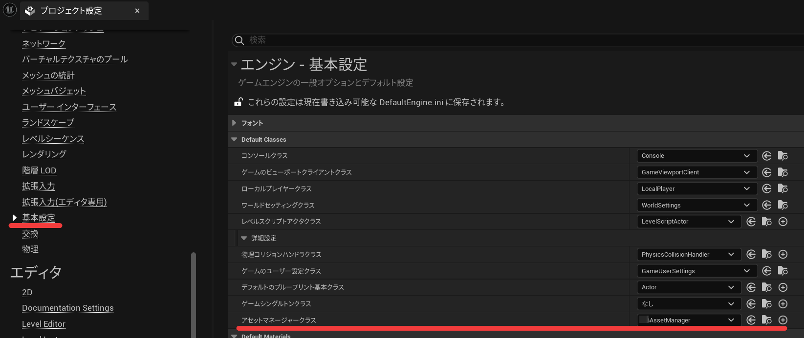
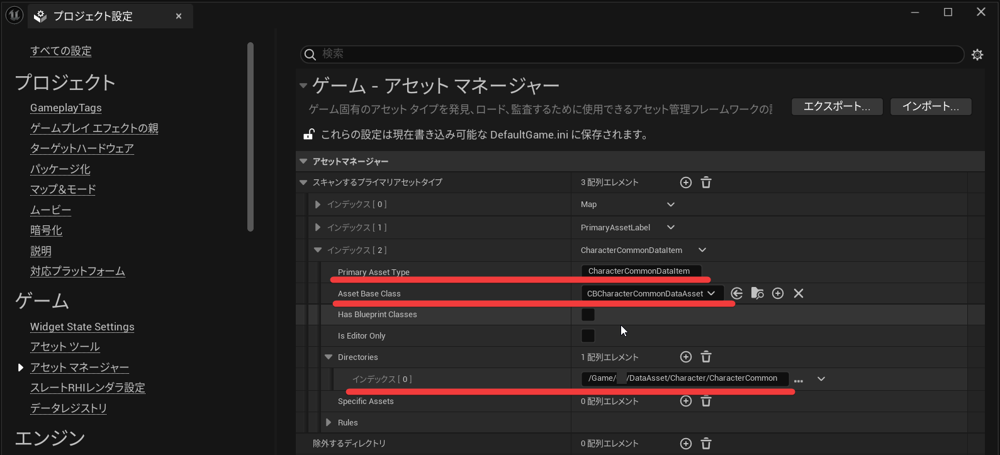

+++
title = "[UE C++]DataAsset"
date = "2024-10-04T11:04:58+09:00"
tags = ["UnrealEngine", ]
+++

## 基本的な DataAsset の使用例

Web の記事を見ると DataTable や AssetManager を交えた別知識も必要な応用例が多いので、DataAsset を作って読み込むだけという基本的な方法を残しておく。

1. UDataAsset を継承してデータ型を作る

   ```cpp:UCharacterDataAsset.h
   UCLASS()
   class UE_HOGE_API UCharacterDataAsset : public UDataAsset
   {
       GENERATED_BODY()

   public:
       // 無敵時間
       UPROPERTY(EditAnywhere, Category="Damage")
       float DamagedInvulnerableDuration = 0.5f;
   };
   ```

1. 作成した型（UCharacterDataAsset）を継承して BP を作成する
   仮に、BP_CharacterDataAsset とする
1. 使用するクラスで参照する
   今回は BP から DataAsset を指定できる状態にして、初期値として先ほど作成したアセットを設定しておく。

   ```cpp:Character.cpp

   // --------------------------------------------------
   // header
   // --------------------------------------------------
   UPROPERTY(EditAnywhere, Category="DataAsset")
   TSoftObjectPtr<class UCharacterDataAsset> CharacterDataAsset;

   // --------------------------------------------------
   // cpp
   // --------------------------------------------------
   ACharacter::ACharacter()
   {
       // 作成したBP_CharacterDataAssetをデフォルトの値として設定
       static ConstructorHelpers::FObjectFinder<UCharacterDataAsset> CharacterDataAssetFinder(TEXT("CharacterDataAsset'/Game/DataAsset/BP_CharacterDataAsset.BP_CharacterDataAsset'"));
       if (ConstructorHelpers.Succeeded())
       {
           CharacterDataAsset = ConstructorHelpers.Object;
       }
   }

   void ACharacter::BeginPlay()
   {
       // 実データ読み込み
       CharacterDataAsset.LoadSynchronous();
   }

   void ACharacter::Hoge()
   {
       // データアクセス
       float value = CharacterDataAsset->DamagedInvulnerableDuration;
   }
   ```

----

- [Unreal Engine の開発が楽になる便利機能を紹介 DataAsset, Subsystem, GameplayAbility 編](https://www.docswell.com/s/EpicGamesJapan/KXVDY5-2022-08-02-124838#p4)

----

## UPrimaryDataAssetをAssetManagerから読み込む

手順で書くと関連性の理解が難しいので、冗長かつコンパクトな最小コードを用意した。

```cpp

// ==================================================
// DataAssetとして扱うデータ
// ==================================================

// --------------------------------------------------
// Header

UCLASS()
class UE_HOGE_API UHogeDataAsset : public UPrimaryDataAsset
{
 GENERATED_BODY()

public:
 // プライマリアセットIDを取得
 virtual FPrimaryAssetId GetPrimaryAssetId() const override
 {
    /*
        Assetmanagerに登録済みのデータを種類とデータ名で一意に特定するID
        第1引数: データ種別を表す文字列、後にEditor設定に登録する名前
        第2引数: データ名を表す文字列
        
        本番用のコードでは、staticでデータ種別を定義してデータ名はアセット自身が名前を返すように実装するのが良いだろう
        ※ HogeItemTypeはAssetManagerあたりのコードに全体で参照できるようstaticで定義したもの
        return FPrimaryAssetId(MyAssetManager::HogeItemType, GetFName());
    */
    return FPrimaryAssetId(TEXT("HogeDataAsset"), FName("HogeDataAssetName"));
 }

 // 何らかのデータ
 UPROPERTY(EditAnywhere)
 float Data = 100.0f;
};

// ==================================================
// 自分のゲーム用に用意するAssetManager
// ==================================================

// --------------------------------------------------
// Header

UCLASS()
class UE_HOGE_API UHogeAssetManager : public UAssetManager
{
 GENERATED_BODY()

public:
 // 自身へアクセスするための関数を提供
 static UHogeAssetManager& GetAssetManager();

 // テストデータのロードを実行
 void PreloadDataAssets();

 // ロード完了時のコールバック
 void OnDataLoaded(FPrimaryAssetId LoadedId);
};

// --------------------------------------------------
// Cpp

// 自身へアクセスするための関数を提供
UHogeAssetManager& UHogeAssetManager::GetAssetManager()
{
 UHogeAssetManager* AssetManager = Cast<UHogeAssetManager>(GEngine->AssetManager);
 if (AssetManager)
 {
  return *AssetManager;
 }
 else
 {
  return (*NewObject<UHogeAssetManager>());
 }
}

// テストデータのロードを実行
void UHogeAssetManager::PreloadDataAssets()
{
 // 読み込みたいデータをFPrimaryAssetIdで指定
 // UHogeDataAssetが実装するGetPrimaryAssetId()に一致することでデータが特定される
 FPrimaryAssetId PrimaryAssetId = FPrimaryAssetId(TEXT("HogeDataAsset"), FName("HogeDataAssetName"));

 // 同期読み込みしたいならば、LoadPrimaryAssetせずとも利用できる
 UHogeDataAsset* DataAsset = this->GetPrimaryAssetObject<UHogeDataAsset>(LoadedId);

 // 非同期データのロードを実行
 // 完了の検知にはコールバック関数の登録で行う
 // コールバック関数の引数は任意で増やすことができる、今回はIDを渡している
 TArray<FName> Bundles;
 this->LoadPrimaryAsset(PrimaryAssetId, Bundles, FStreamableDelegate::CreateUObject(this, &UHogeAssetManager::OnDataLoaded, PrimaryAssetId));

 // このような省略も可能
 // this->LoadPrimaryAsset(PrimaryAssetId, { }, FStreamableDelegate::CreateUObject(this, &UHogeAssetManager::OnDataLoaded, PrimaryAssetId));
 
}

// ロード完了時のコールバック
void UHogeAssetManager::OnDataLoaded(FPrimaryAssetId LoadedId)
{
 // ロードしたオブジェクトを取得
 UHogeDataAsset* DataAsset = this->GetPrimaryAssetObject<UHogeDataAsset>(LoadedId);

 if (DataAsset != nullptr)
 {
  // ログに出すなど
  UKismetSystemLibrary::PrintString(this, FString::Printf(TEXT("Data: %d"), DataAsset->Data));
 }
}
```

コード側の準備は以上。  
この上で、プロジェクトにAssetManagerと対象のDataAssetを登録し、テスト用関数のUHogeAssetManager::PreloadDataAssets()を実行すれば読み込んだデータの値がPrintされる。

- 編集 → プロジェクト設定 → 基本設定 → DefaultClasses → アセットマネージャークラス に自前のAssetManagerを設定
    

- 編集 → プロジェクト設定 → 基本設定 →アセットマネージャー
    以下の項目を設定する
  - PrimaryAssetType
  - AssetBaseClass
  - Directories

    

----

- [C++でPrimaryAssetのAsyncLoadを実現する方法【UE5】 - こっこのぶろぐ](https://empkocko.hatenablog.com/entry/20240914/1726314227)
- [DataAssetで非同期ロードをしてみよう](https://blog.alche.studio/posts/E9yd4xjtweTaZZx1FwaXO/)
- [AssetManagerの作成](https://zenn.dev/hakuto_gamedev/articles/3d1da6aa0c7fe0)
- [PrimaryDataAssetの作成](https://zenn.dev/hakuto_gamedev/articles/e1f8dfb61ec76b)

----
